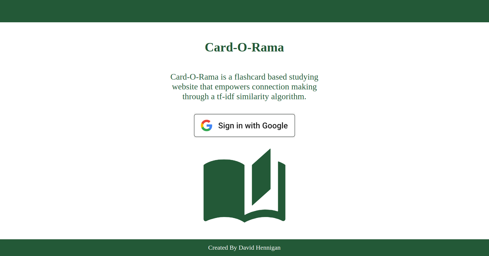
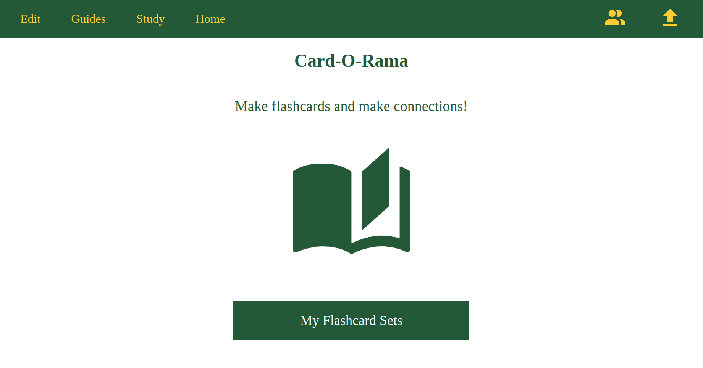
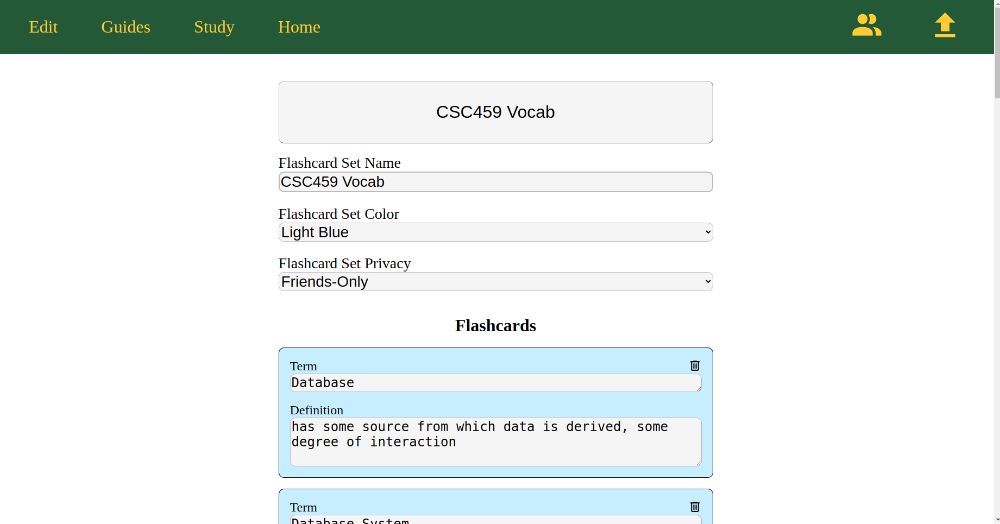
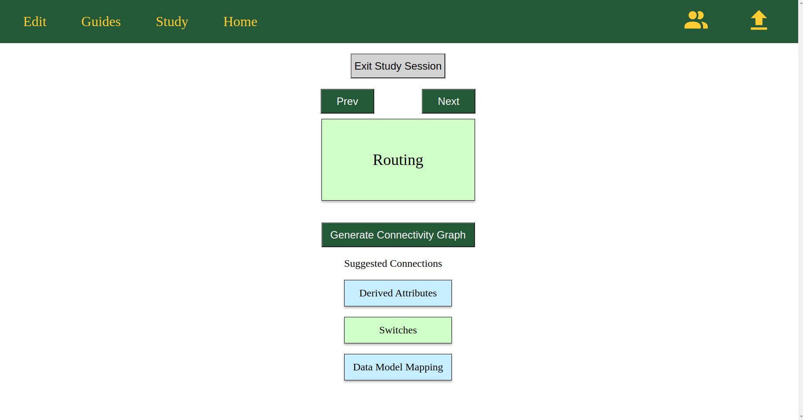
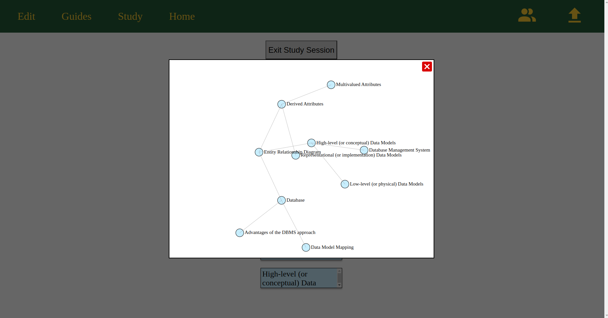
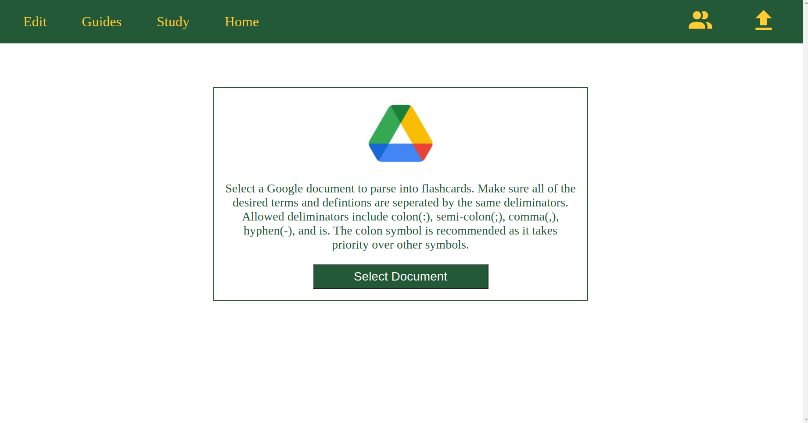
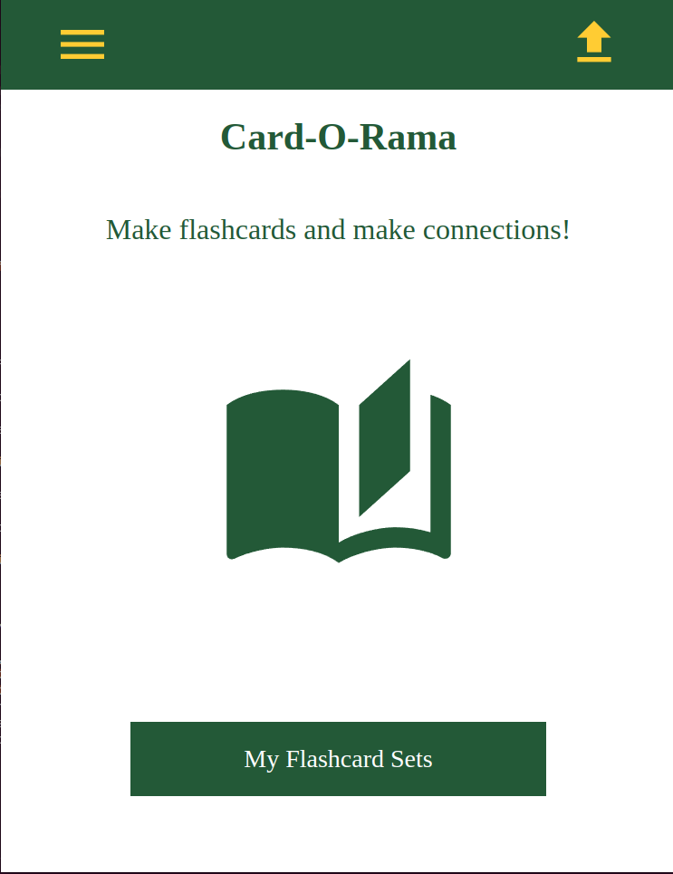
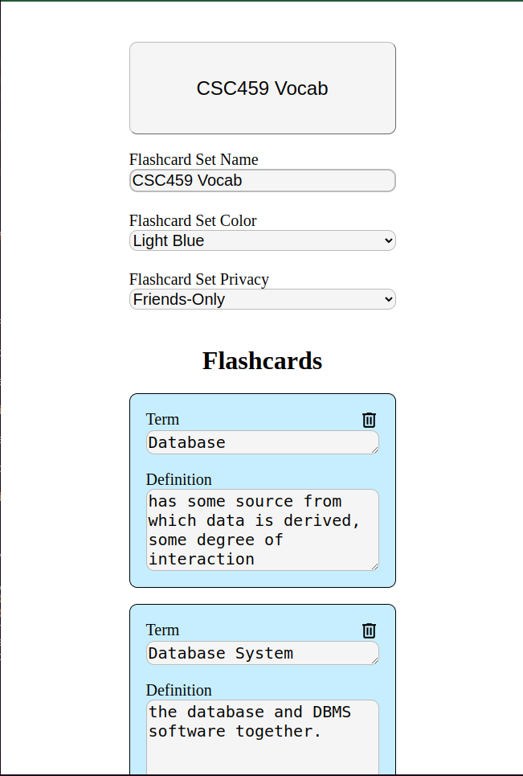

# CSC495-CardORama

## Overview
Card-O-Rama is a web full stack study application that empowers the user to develop connections between concepts
by leveraging a tf-idf algorithm. Users can view interactive connection graphs that can connect mutliple flashcard sets
together. Card-O-Rama's customizability allows users to differentiate flashcard sets in a study session by color.

## Screenshots of the Application
### Login Page

### Home Page

### Flashcard Set Edit Page

### Study Session Page

### Interactive Connection Graph

### Google Document Parsing Page

### Some Mobile Views

## Technologies Used
### Languages Used
* Java 17
* Javascript
* Html
* CSS
* MySQL
* Docker
### Frameworks Used
* Sveltekit
* Spring Boot
### Dependencies Used
* D3.js
* svelte-dnd-action
* sweetalert2
* Google OAuth2
* Java Google Doc Api
* Spring Boot Security
* Spring Boot OAuth2 Client
* Spring Boot JPA
* Java MySQL Connector
* Spring Cloud Gateway

## Build Instructions

